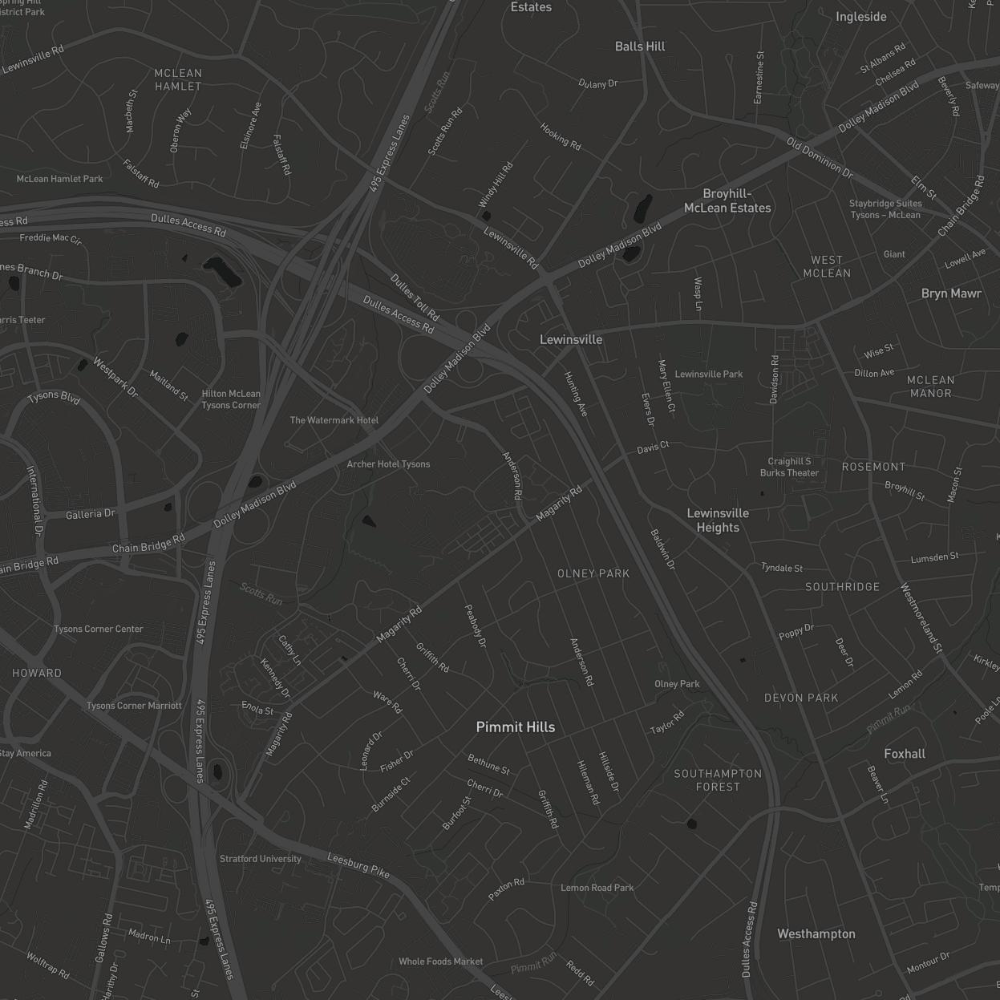
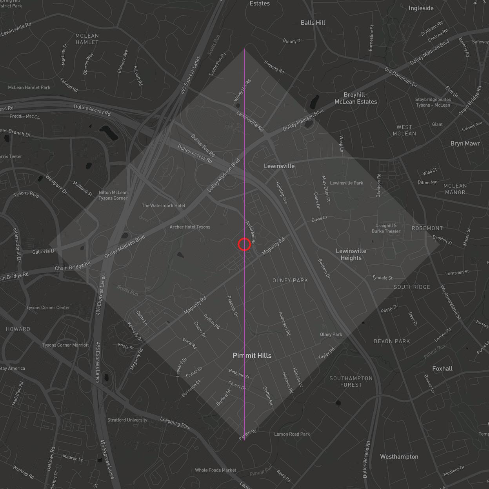
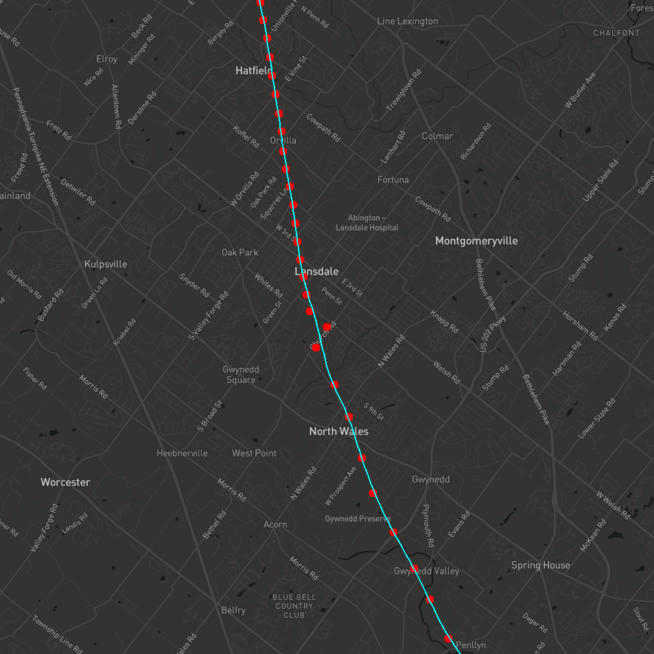

## The Map Making Features in Commons

The package `org.mitre.caasd.commons.maps` contains utilities for map making.

1. `MapBuilder` is the easiest way to make maps. This is a standard Builder that provides fluent map making.
1. You can manually create a map using `MapImage`. This class gets multiple map tiles from a `TileServer` and stitches
   them together into a single properly cropped image.
1. `MapFeatures` and `FeatureSetBuilder` provide fluent apis for creating objects to be drawn on a map.
1. The `PixelLatLong` class is an extremely useful class when trying to tie together real world `LatLong` location data
   with pixel coordinates system map tiles use.

### About TileServers

A `TileServer` is an abstraction around a service that can
provide [map tiles](https://docs.microsoft.com/en-us/azure/azure-maps/zoom-levels-and-tile-grid?tabs=csharp). The
Commons project has a few built in TileServer implementation:

- `MapBoxAPI`: This `TileServer` can provide 7 different styles of maps including: Streets, Outdoors, Light, Dark,
  Satellite, and Satellite_Streets.
    1. **Important** - Using the MapBoxApi requires passing a valid Mapbox Access token into the JVM. This can be done
       one of three ways:  Setting an environment variable, setting a Java System property, or placing a file
       named `mapbox.token` in the user directory.
    1. If you use the file-based approach then the `mapbox.token` file should look
       like: `MAPBOX_ACCESS_TOKEN=this.IsNotAValidKey.EvenThoughILookLikeOne`


- `MonochromeTileServer`: This provides simple one color background tiles. In addition to simple Maps this tile server
  can be useful during unit testing because the tiles it provides never change pixels.


- `DebugTileServer`:  This provides tiles with a "background test pattern" to help debug map making issues.

### Making an Undecorated Map

Create a MapImage directly using the constructor.

```
MapImage map = new MapImage(
    new MapBoxApi(DARK), 
    LatLong.of(32.8968, -97.0380), 
    Distance.ofNauticalMiles(10)
);
```

Once you have the `MapImage` you can:

1. Export it as a BufferedImage using: `BufferedImage img = map.plot();`
1. Write it to a File using: `map.plotToFile(new File("mapWithoutDecoration.jpg"));`



### Adding MapFeatures to a Map

Here is an example of drawing stuff on a map

```
LatLong lostDog = LatLong.of(38.9223, -77.2016);

MapImage map = new MapImage(
    new MapBoxApi(DARK),
    lostDog,
    Distance.ofNauticalMiles(2.5)
);

//create a list of MapFeatures that need to be drawn...
FeatureSet features = newFeatureSetBuilder()
    .addCircle(lostDog, Color.RED, 30, 4.0f)
    .addLine(
        lostDog.project(NORTH, Distance.ofNauticalMiles(1.0)),
        lostDog.project(SOUTH, Distance.ofNauticalMiles(1.0)),
        Color.MAGENTA,
        1.f
    )
    .addFilledShape(
        boxAround(lostDog),
        new Color(255, 255, 255, 25)) //use Alpha channel for transparency!
     .build();

map.plotToFile(features, new File("mapWithDecoration.jpg"));
```



### Using MapBuilder to build maps

The `MapImage` and `FeatureSet` classes grows less convenient to use as the maps you make get more complicated.
Using `MapBuilder` will help ease the burden.  Here are some examples

example 1

```
newMapBuilder()
    .mapBoxDarkMode()
    .center(LatLong.of(32.8968, -97.0380))
    .width(Distance.ofNauticalMiles(10))
    .addFeature(randomPath())
    .toFile(new File("random walk.png"));
```

example 2

```
newMapBuilder()
    .mapBoxDarkMode()
    .center(home)
    .width(Distance.ofNauticalMiles(7.5))
    .useLocalDiskCaching(Duration.ofDays(7))
    .addFeatures(circlesForRawRadarHits)
    .addFeature(smoothedTrackPath)
    .toFile(new File("trackWithGentleError.png"));
```



